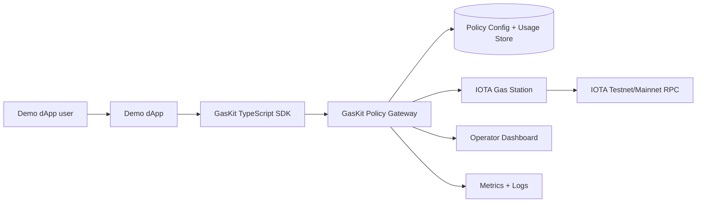

# IOTA GasKit

IOTA GasKit is an open-source toolkit for deploying, securing, monitoring, and integrating sponsored transaction infrastructure around the official IOTA Gas Station component.

It is designed for IOTA dApp teams that want gasless onboarding without rebuilding the same production tooling from scratch: deployment templates, app keys, policy controls, quotas, SDK wrappers, an operator dashboard, metrics, alert examples, and hardening documentation.

> Grant scope: this repository is the open-source toolkit. A future managed service may offer hosting, support, SLAs, and enterprise onboarding, but the grant-funded core remains independently deployable and inspectable.

## Why GasKit exists

IOTA Gas Station solves the core sponsored-transaction primitive. Production builders still need the adoption layer around it:

- safe local and cloud deployment paths;
- app-level credentials and quotas;
- package/function allowlists;
- wallet and request limits;
- usage logs and policy rejection reasons;
- SDK and backend examples;
- operator visibility and alerts;
- sponsor-wallet and secret-management guidance.

GasKit packages those pieces into a reusable open-source toolkit.

## Current status

This repo is in grant-readiness sprint mode. The current implementation is being extracted from a working GaaS prototype that already includes an Express gateway, dashboard, API-key auth, quota tracking, Docker deployment, and monitoring assets.

Implemented in this clean grant repo now:

- open-source project hygiene;
- policy reason-code/shared type scaffold;
- policy gateway decision engine scaffold with tests;
- TypeScript SDK scaffold with tests;
- demo app and example integration scaffolds;
- grant, security, architecture, and reviewer docs.

Upcoming grant milestones add the full local deployment demo, complete policy gateway integration, operator dashboard views, observability pack, and final demo video.

## Target architecture



## Repository layout

```txt
apps/
  demo-dapp/              # Minimal grant-demo dApp scaffold
packages/
  sdk/                    # TypeScript SDK scaffold
  policy-gateway/         # Policy decision engine scaffold
  shared-types/           # Shared policy/request/response types
deploy/
  docker-compose/         # Local deployment templates
docs/
  quickstart.md
  architecture.md
  deployment.md
  policy.md
  sdk.md
  threat-model.md
  production-hardening.md
  grant-milestones.md
  reviewer-checklist.md
examples/
  nextjs-api-route/
  node-backend/
  policies/
```

## Quickstart preview

Install dependencies and run the scaffold tests:

```bash
npm install
npm test
npm run typecheck
```

The full 30-minute local Gas Station quickstart is tracked in `docs/quickstart.md` and will be completed during Milestone 1.

## License

Apache-2.0. See `LICENSE`.

## Security

Do not commit sponsor private keys, API keys, bearer tokens, or wallet secrets. See `SECURITY.md`, `docs/security/secrets.md`, and `docs/security/sponsor-wallet.md`.
