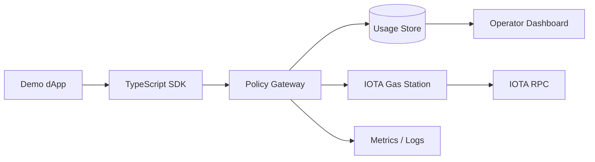

# Architecture

## Components

- IOTA Gas Station: official sponsored-transaction component.
- GasKit Policy Gateway: validates app credentials, policy, quotas, and metadata before proxying to Gas Station.
- GasKit Usage Store: stores app config, policy decisions, and usage events.
- TypeScript SDK: typed wrapper for dApp backends.
- Operator Dashboard: health, usage, policy, and rejection visibility.
- Demo dApp: reviewer-verifiable sponsored transaction flow.
